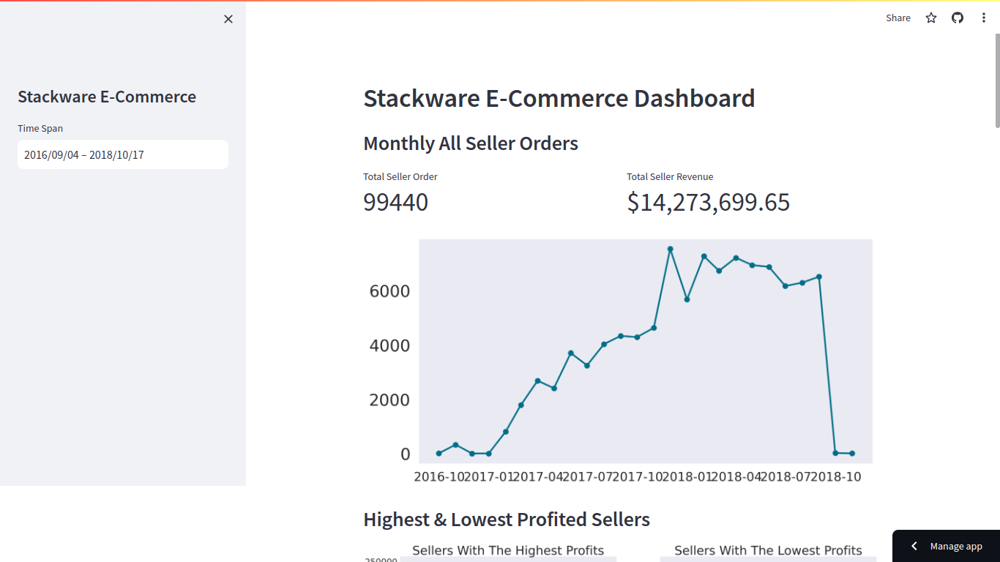

# Stackware E-Commerce Dashboard
## Setup Environment
```
pipenv install 
pipenv shell
pipenv install numpy pandas matplotlib seaborn streamlit babel
```

## Run Streamlit
```
streamlit run dashboard.py
```
## Link Streamlit Cloud
https://ecommerce-python-data-analysis.streamlit.app/



## Cluster Analisis
metode ini digunakan untuk mencari insight dari penyebab kenaikan dan penurunan revenue/pendapatan seller.

Seller revenue dengan cluster analisis yang dilakukan per seller dan per bulan dengan masing masing 3 hubungan identifikasi sebagai berikut:
1. Mengidentifikasi hubungan antara seller revenue dan order count
2. Mengidentifikasi hubungan antara order count dan order review
3. Mengidentifikasi hubungan antara seller revenue dan order review


